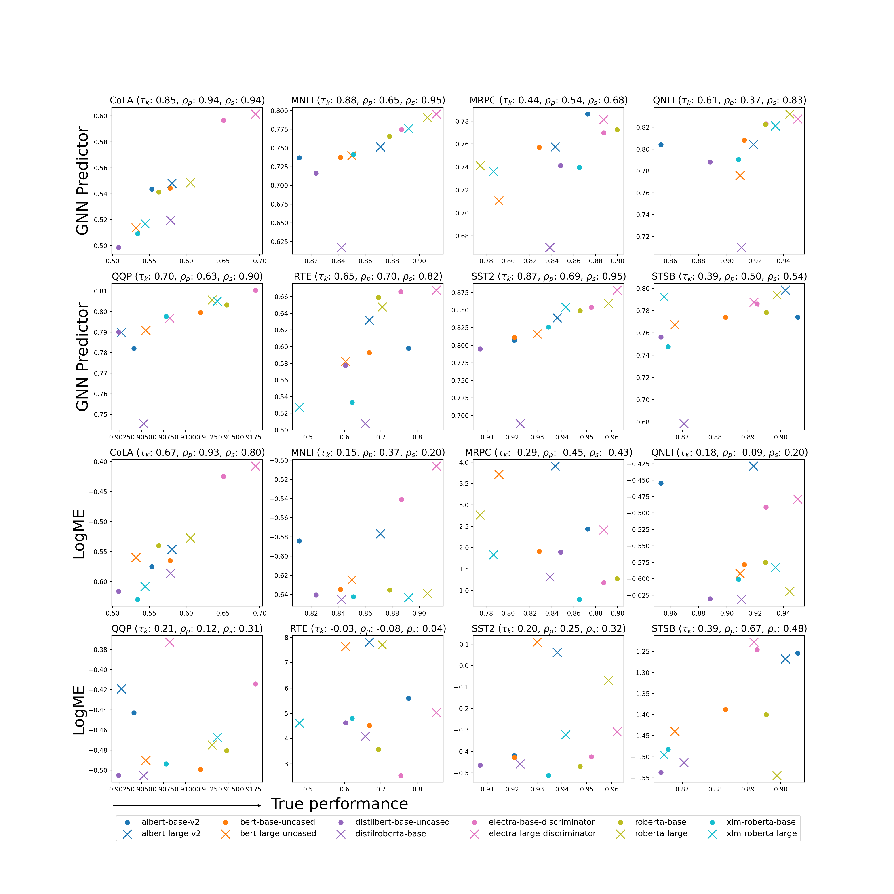
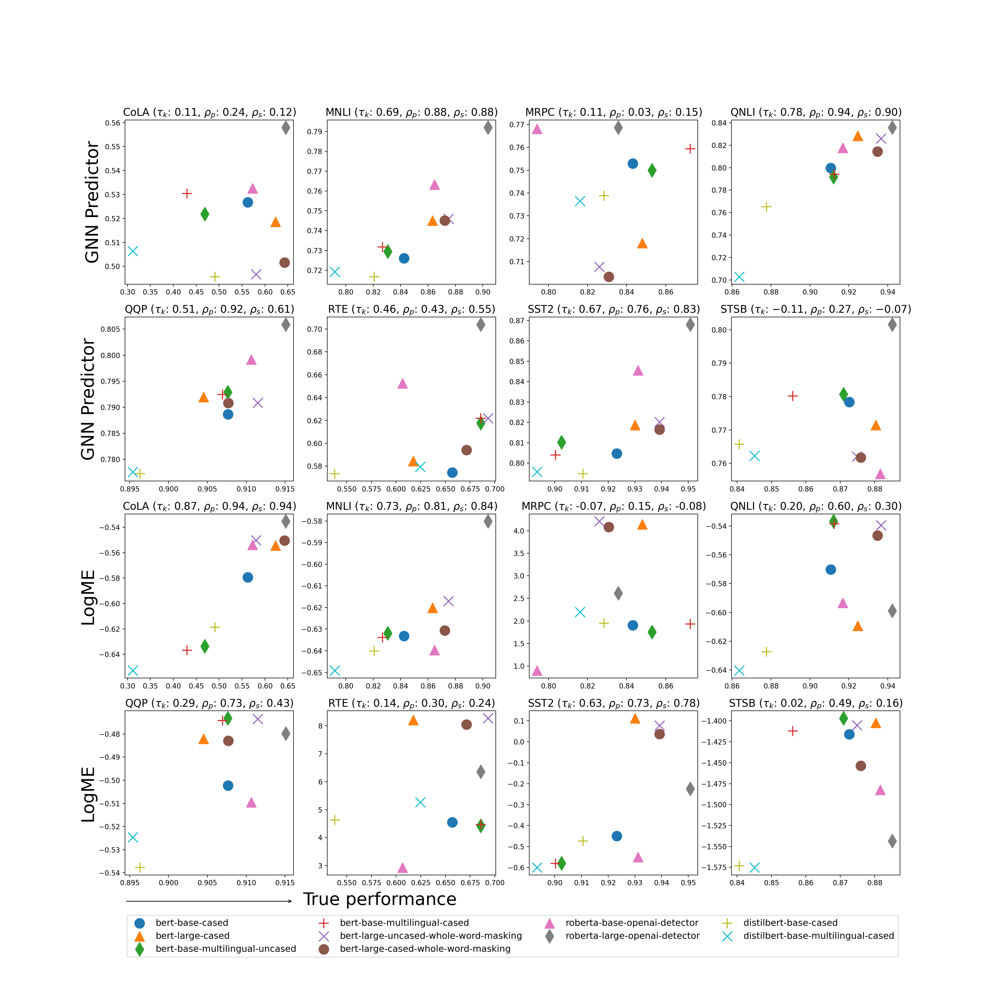
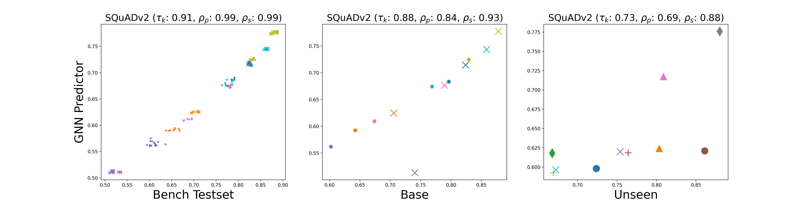

# Universal Embedding for Pre-trained Models and Data bench

This repository is the official implementation of Universal Embedding for Pre-trained Models and Data bench.

## Data preperation

A data bench is located in ***ptm_model_bench*** folder. To download ***ptm_model_bench*** folder, install git lfs by

```download
$ git lfs install
```

The detail process of dataset generation can be found in dataset_generation/README.md.

## Requirements

To train gnn-based model performance predictor install

```setup
virtualenv ptm_recommender_env
source ptm_recommender_env/bin/activate
pip install -r requirements.txt
```

or

```
pip install numpy 
pip install torch==1.12
pip install tqdm
pip install networkx
pip install dill
pip install -U scikit-learn
```

## Training

To train the model(s) in the paper, run this command:

```train
python train.py
```

The result files will be saved in results/gcnn_ptm_model_bench.

## Results

We compare our results with logME for GLUE tasks. For each PTM we plot true performance and predicted performance.
We used kendal tau, pearson and spearman correlation between true perfomance and estimate performance of ptm models to evaluate our approach.

In the image $\tau_k$ implies kendal tau, $\rho_p$ implies pearson and $\rho_s$ implies spearman correlation.

### Results on GLUE
#### results on testsets

<p float="left">

</p>

#### results on base models

<p float="left">
  
</p>

#### results on unseen base models

<p float="left">
  
</p>

### Results on SQuAD_v2
<p float="left">
  
</p>

## Acknowledgements

The code is based on

* How Powerful are Graph Neural Networks? ([https://github.com/weihua916/powerful-gnns](https://github.com/weihua916/powerful-gnns))
